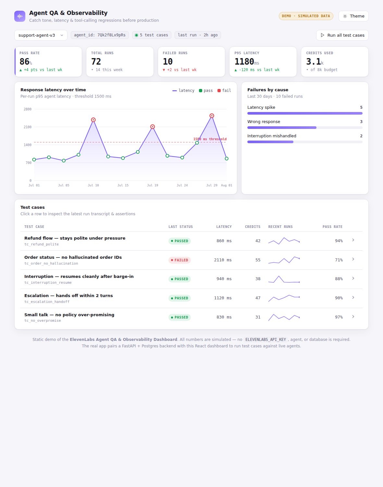

# ElevenLabs Agent QA & Observability Dashboard

Test and monitor [ElevenLabs Agents Platform](https://elevenlabs.io/docs/agents-platform) agents over time — catch tone,
latency, and tool-calling regressions before they hit production.

## Live demo



The dashboard runs as a **self-contained static demo**: when no backend is reachable it serves a built-in
simulated dataset, so the exact same build works against a live FastAPI backend in development and as a
zero-backend demo on any static host. No `ELEVENLABS_API_KEY`, agent, or database is required to view it.

Deploy it to **GitHub Pages** with the included workflow (`.github/workflows/pages.yml`):

1. Push to `main` (the workflow builds `frontend/` and publishes it).
2. One-time: repo **Settings → Pages → Build and deployment → Source: GitHub Actions**.

The site is then served at `https://<user>.github.io/elevenlabs-agent-qa-dashboard/`. It also builds cleanly
for any other static host — `cd frontend && npm install && npm run build` produces a deployable `dist/`.

## Problem

The ElevenLabs open-source ecosystem is full of agent *creation* demos (outbound-call
bots, ordering agents, MCP wrappers). None of them address agent *testing* or
*observability*, even though evaluation, guardrails, and versioning are called out as
active priorities in ElevenLabs' own docs. This project fills that gap by building on
the Agents Platform surface rather than the TTS surface.

## How it works

1. Define expected conversation flows and assertions as **test cases**.
2. Run test cases against a live agent via the ElevenLabs Agents Platform API.
3. Capture the resulting conversation transcripts asynchronously (conversations are
   long-running, so runs are polled rather than awaited inline).
4. Analyze each transcript against its assertions and flag latency spikes,
   interruption mishandling, or wrong responses.
5. Persist results so pass/fail and trend history survive across runs.
6. View pass/fail status and trends on the dashboard.

## Architecture

```
┌─────────────┐     trigger run      ┌──────────────────┐
│   React     │ ───────────────────▶ │     FastAPI       │
│  Dashboard  │                      │     Backend       │
│             │ ◀─────────────────── │                    │
└─────────────┘   pass/fail + trend  └─────────┬──────────┘
                                                │
                          ┌─────────────────────┼─────────────────────┐
                          │                     │                     │
                          ▼                     ▼                     ▼
                 ┌────────────────┐   ┌──────────────────┐   ┌────────────────┐
                 │  Test-case      │   │  ElevenLabs       │   │  Latency /      │
                 │  runner         │──▶│  Agents Platform  │   │  interruption   │
                 │  (assertions)   │   │  API (async poll) │   │  analyzer       │
                 └────────────────┘   └──────────────────┘   └────────┬───────┘
                                                                       │
                                                                       ▼
                                                            ┌────────────────────┐
                                                            │     Postgres        │
                                                            │  (test cases, runs,  │
                                                            │   results, history)  │
                                                            └────────────────────┘
```

**Why these pieces:**
- **FastAPI** — conversation calls are long-running and must be polled, not awaited
  synchronously; FastAPI's async model fits that natively.
- **Postgres** — trend history needs to survive across runs, so state must be durable,
  not just live/ephemeral (this ruled out Redis).
- **React** — the dashboard's core value is pass/fail + latency/trend charts over time.

## Tech stack

| Layer         | Choice                                   |
|---------------|-------------------------------------------|
| Backend       | FastAPI (async)                            |
| Database      | Postgres (via SQLAlchemy, async driver)    |
| Frontend      | React + Vite + TypeScript                  |
| Integration   | ElevenLabs Agents Platform Python SDK       |
| CI            | GitHub Actions (lint + test)               |

## v1 scope

- [x] Dashboard: pass/fail results + trend history over time *(built; runs on simulated data as a static demo)*
- [ ] Define test cases (expected conversation flow + assertions) as config
- [ ] Run test cases against a live agent via the ElevenLabs API
- [ ] Flag failures: wrong response, latency spike, interruption mishandling

## Stretch goals

- Credit-cost tracking per test run
- Slack alert on regression

## Project structure

```
backend/    FastAPI app, SQLAlchemy models, ElevenLabs client, tests
frontend/   React + Vite dashboard
docker-compose.yml   Local Postgres for development
```

## Local setup

### Backend

```bash
cd backend
python -m venv .venv && source .venv/bin/activate
pip install -r requirements.txt
cp .env.example .env   # add ELEVENLABS_API_KEY and DATABASE_URL
uvicorn app.main:app --reload
```

### Frontend

```bash
cd frontend
npm install
npm run dev
```

### Database

```bash
docker compose up -d db
```

## Status

The **dashboard frontend is built and hostable** as a static demo (see above), running on a simulated
dataset via a graceful fallback in `frontend/src/api.ts`. The backend skeleton and CI are in place; the
test-case runner and live ElevenLabs integration are the next pieces to wire up, at which point the
dashboard's demo fallback is transparently replaced by real data.

## License

MIT
